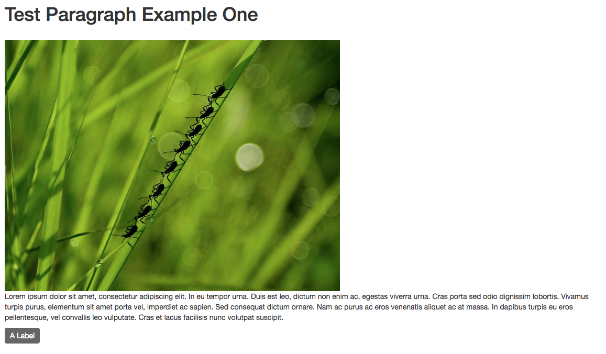

# Component based theme using UI-Patterns

[UI Patterns](https://www.drupal.org/project/ui_patterns) can expose stand-alone theme components (patterns) to Drupal and enables them to be used with the core Layout and Views module and well-known contrib modules like Field Group, Display Suite and Panels.

Here is explained how to create a component library by an example that includes two components:

* `Button One`
* `Paragraph One` (include `Button One`)

## Requirements

The `Drupal` modules required are:

* [Component Libraries](https://www.drupal.org/project/components)
* [Display Suite](https://www.drupal.org/project/ds)
* [Paragraphs](https://www.drupal.org/project/paragraphs)
* [UI Patterns](https://www.drupal.org/project/ui_patterns)

## Build component library

#### 1. Create the components library

We must define our components library into the `[THEME_NAME].info.yml` of our theme:

    component-libraries:
      atoms:
        paths:
          - components/atoms
      paragraphs_component:
        paths:
          - components/paragraphs

where `atoms` and `paragraphs` are the names of the component libraries we are defining, and in `paths` we define the folder that contains the components of the library.

Then we must create the folders of the paths defined above. So, inside our theme directory, create the folders:

* components/atoms
* components/paragraphs

#### 2. Create the component button-one

A `.ui_patterns.yml` file is used to define the components provided by a theme or a module and expose them to `Drupal`. `UI Patterns` will use all `.ui_patterns.yml` files it finds in a theme’s or module’s directory structure, so it is possible to create component-specific files!

Let's create, inside our theme directory, the file `[THEME_NAME].ui_patterns.yml` with the following content to define the `button-one` component:

    button_one:
      label: Button one
      description: A button template.
      fields:
        button_one_label:
          type: string
          label: Button label
          description: The label to print into the button.
          preview: Label
      use: '@atoms/buttons/button-one/button-one.html.twig'

We must now create the template file declared above. So, in our component library directory (`component/atoms`), let's create the folder `buttons/button-one` and create the file `button-one.html.twig` inside it.

#### 3. Create the component paragraph-one

Let's add to `[THEME_NAME].ui_patterns.yml` the definition of `paragraph-one` component:

    paragraph_one:
      label: Paragraph one
      description: A paragraph template.
      fields:
        image:
          type: image
          label: Image
          description: An image.
          preview: ''
        text:
          type: text
          label: Text
          description: A text.
          preview: Lorem ipsum dolor sit amet, consectetur adipiscing elit. Duis eget vulputate tellus, vel aliquam sapien. Donec convallis nibh eu volutpat egestas. Nullam enim metus, placerat eleifend condimentum id, sodales in arcu. Quisque vel lacus odio. Nullam vel massa quis lectus ullamcorper placerat. Cras at turpis nec nisl porttitor posuere quis et massa. Etiam mattis leo nec laoreet venenatis. Donec dictum nunc eget tristique molestie. Duis vel mi justo. Vivamus sagittis justo erat, eu tempor elit malesuada in. Praesent sem lorem, aliquet lobortis rhoncus sed, sagittis vitae nunc. Phasellus convallis dui a augue hendrerit, non scelerisque augue mollis. Vivamus congue, mi sit amet rhoncus finibus, nisi nisi posuere mi, id dictum nibh augue nec arcu.
        button_label:
          type: string
          label: Button label
          description: The label to print into the button.
          preview: Label
      use: '@paragraphs_component/paragraph-one/paragraph-one.html.twig'

We must now create the template file declared above. So, in our component library directory (`component/paragraphs`), let's create the folder `paragraph-one` and create the file `paragraph-one.html.twig` inside it.

#### 4. Create the asset library for component button-one

We must define our asset library into the `[THEME_NAME].libraries.yml` of our theme:

    button.one:
      version: 1.x
      css:
        component:
          components/atoms/buttons/button-one.css: {}
      js:
        components/atoms/buttons/button-one.js: {}
      dependencies:
        - core/jquery
        - core/jquery.once

We must now create the asset files for `button-one.css` and `button-one.js` inside the theme directory declared above.

Finally, let's add the defined asset to the component `button-one` defined in `[THEME_NAME].ui_patterns.yml` adding the `libraries` parameter. So our component pattern definition must look like:

    button_one:
      label: Button one
      description: A button template.
      fields:
        button_one_label:
          type: string
          label: Button label
          description: The label to print into the button.
          preview: Label
      libraries:
        - [THEME_NAME]/button.one
      use: '@atoms/buttons/button-one/button-one.html.twig'

#### 5. Code for the component button-one

Let's add the code to the `button-one` component template `button-one.html.twig`:

    <button class="btn-one" type="button">{{ button_one_label }}</button>

where `{{ button_label }}` is the variable declared in our component pattern.

Let's add the `css` code to `button-one.css`:

    .btn-one {
      background: #666666;
      color: #ffffff;
      display: inline-block;
      padding: 10px 5px;
    }

Let's add the `javascript` to `button-one.js`:

    (function($, Drupal, drupalSettings) {
      'use strict';

      Drupal.behaviors.buttonOne = {

        /**
         * Drupal attach behavior.
         */
        attach: function(context, settings) {
          $('.button-one').once('button-one-click').click(function() {
            $("
You clicked on button one!
").dialog();
          });
        }
      };

    }(jQuery, Drupal, drupalSettings));

#### 6. Code for the component paragraph-one

Let's add the code to the `paragraph-one` component template `paragraph-one.html.twig`:

    

      
{{ image }}

      
{{ text }}

      
{{ pattern('button_one', {button_one_label: button_label}) }}

    

With `{{ pattern('button_one', {button_one_label: button_label}) }}` we are able to re-use the component pattern `button-one` to print the paragraph button.

#### 7. Create the paragraph

First of all let's clean the `Drupal` cache to register the defined libraries:

    drush cr

Now, from the `Drupal` UI, let's create the paragraph `Paragraph Example One`:

Let's associate to it the pattern `Paragraph one` we created:

As you can see we associated the created pattern, in the `Select a layout` section (below the screen), and we mapped the paragraph fields to the pattern fields.

Finally we can create a content with the created paragraph that must look like:

