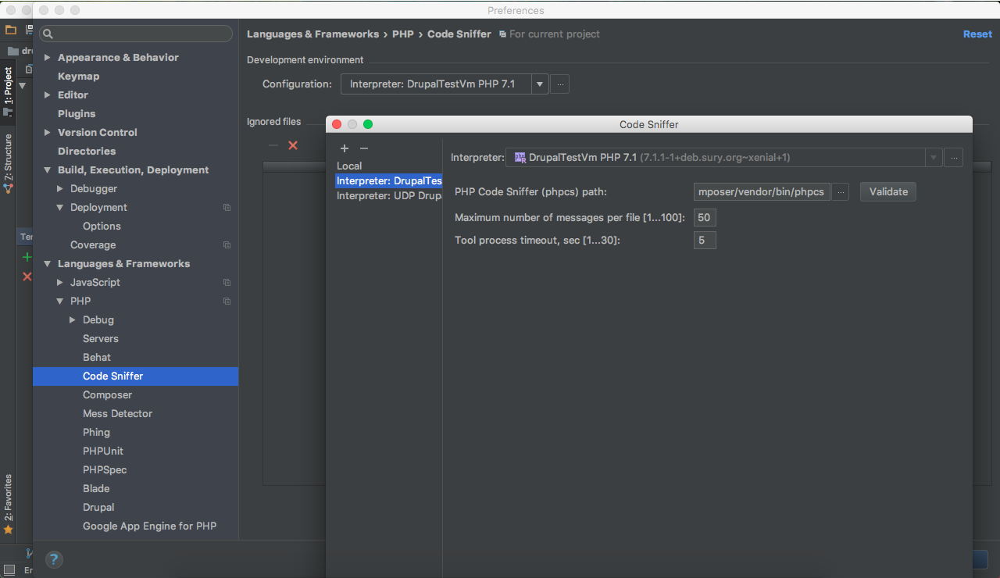
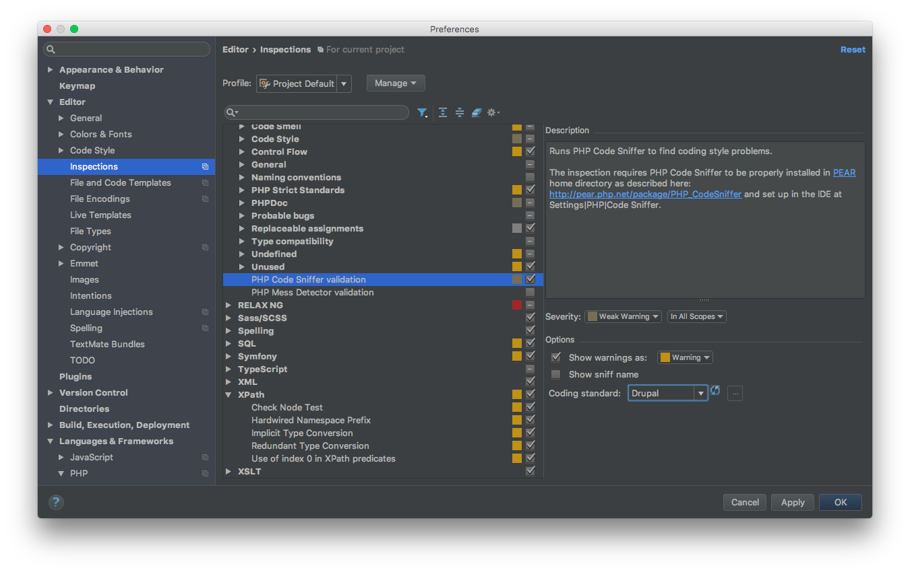

# Coder Sniffer

[Coder Sniffer](https://www.drupal.org/node/1419988) is a library that tokenises PHP, JavaScript and CSS files and detects violations of a defined set of coding standards. It works with Drupal 6, 7, or 8.

## Install and configure Coder Sniffer

#### 1. Add Coder Sniffer to your Vagrant machine

Open the vagrant machine `config.yml` file and add to `composer_global_packages` the line:

    - { name: drupal/coder, release: '*' }
      
From your `terminal` go on the `vagrant` directory and run `vagrant up --provision`, to apply the changes on your `vagrant` machine, or run `vagrant provision` if your machine is already up.

Enter on your `vagrant` machine (`vagrant ssh`) and run:
    
    phpcs --config-set installed_paths ~/.composer/vendor/drupal/coder/coder_sniffer
    
You can verify this has worked with:
    
    phpcs -i

The above command should include `DrupalPractice` and `Drupal` in the installed `coding standards` list.

#### 2. Integrate Code Sniffer in PhpStorm

From below select `+` and add `Code Sniffer by Remote Interpreter`. Select your vagrant `PHP interpreter` (see [Add GitHub repository and Initial Commit](drupal_vm_phpstorm.md#2-integrate-vagrant)). In `PHP Code Sniffer (phpcs) path` enter `/home/vagrant/.composer/vendor/bin/phpcs`.
Click on `Validate` to verify that has worked.

Go under `Settings` -> `Editor` ->  `Inspections` to enable and set `PHP Code Sniffer Validation` as below:

## Inspect Code

To inspect your code select, from the menu, `Code` -> `Inspect Code`. On the shown window select what you wanna inspect and click `OK`.

