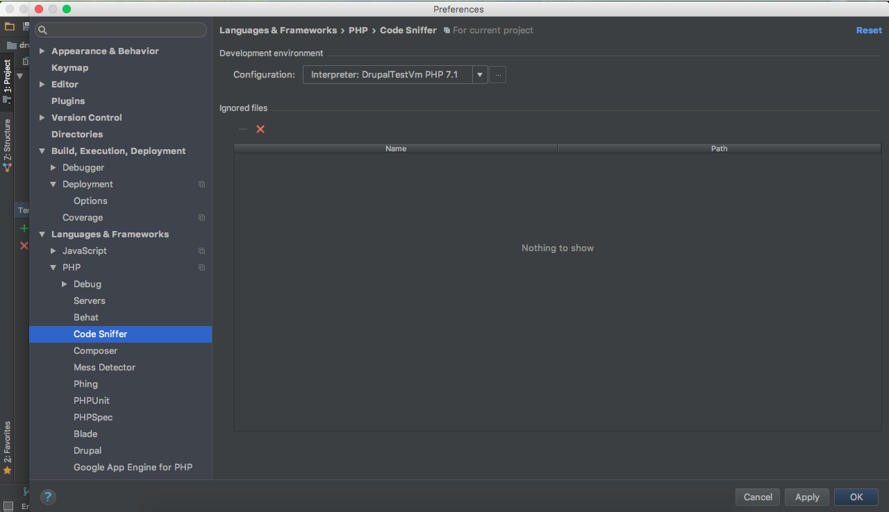

# Coder Sniffer

[Coder Sniffer](https://www.drupal.org/node/1419988) is a library that tokenises PHP, JavaScript and CSS files and detects violations of a defined set of coding standards. It works with Drupal 6, 7, or 8.

## Basics

#### 1. Add Coder Sniffer to your Vagrant machine

Open the vagrant machine `config.yml` file and add to `composer_global_packages` the line:

    - { name: drupal/coder, release: '*' }
      
From your `terminal` go on the `vagrant` directory and run `vagrant up --provision`, to apply the changes on your `vagrant` machine, or run `vagrant provision` if your machine is already up.

Enter on your `vagrant` machine (`vagrant ssh`) and run:
    
    phpcs --config-set installed_paths ~/.composer/vendor/drupal/coder/coder_sniffer
    
You can verify this has worked with:
    
    phpcs -i

The above command should include `DrupalPractice` and `Drupal` in the installed `coding standards` list.

#### 2. Integrate Code Sniffer in PhpStorm

From below select `+` and add `Code Sniffer by Remote Interpreter`. Select your vagrant `PHP interpreter` (see [Add GitHub repository and Initial Commit](drupal_vm_phpstorm.md#2-integrate-vagrant)). In `PHP Code Sniffer (phpcs) path` enter `/home/vagrant/.composer/vendor/bin/phpcs`.
Click on `Validate` to verify that has worked.

Go under `Settings` -> `Editor` ->  `Inspections` to enable and set `PHP Code Sniffer Validation` as below:

#### 3. Inspect Code

To inspect your code select, from the menu, `Code` -> `Inspect Code`. On the shown window select what you wanna inspect and click `OK`.

## Setup a Git pre-commit hook to check Drupal Coding Standards

The `PhpStorm` commit window already integrate the `Perform code analysis` tool but, for some reason, it's not able to run the `PHP Code Sniffer Validation` as when you launch the normal `Inspect Code`.

So we need an alternative way to do it properly.

First of all be sure to have the [Pre Commit Hook Plugin](drupal_vm_phpstorm.md#pre-commit-hook-plugin) installed and enabled.

The following instructions are to setup the `pre-commit` hook script at the init of the project. If you are not sure that your project was already init for it you must check for:

* your `composer.json` and look for the package `jover_be/drupal-code-check` (probably it's under `require-dev`)
* your `drupal` root directory and look for the `pre-commit-hook.sh` file

If you have both you can jump directly to [Run the Pre Commit Code Analysis](drupal_vm_codersniffer.md#3-run-the-pre-commit-code-analysis).

#### 1. Install Drupal Code Check Package

[Drupal Code CHeck](https://packagist.org/packages/jover_be/drupal-code-check)

From your `vagrant` machine on your `drupal` root directory run:

    composer require --dev jover_be/drupal-code-check

Be sure the `pre-commit` scripts of the installed package are executable:

    chmod +x vendor/jover_be/drupal-code-check/git-hooks/pre-commit
    chmod +x vendor/jover_be/drupal-code-check/git-hooks/pre-commit.php

#### 2. Pre Commit Hook Script

The `Pre Commit Hook Plugin` looks for the `pre-commit-hook.sh` file script on your project root directory. So let's create it as a relative link to the `Drupal Code Check` script:

    ln -s vendor/jover_be/drupal-code-check/git-hooks/pre-commit pre-commit-hook.sh

Let's link the script also on the default git hooks folder, in case you manually commit from the shell:

    cd .git/hooks
    ln -s ../../vendor/jover_be/drupal-code-check/git-hooks/pre-commit pre-commit

#### 3. Run the Pre Commit Code Analysis

If everything is well set, when you perform a commit `PhpStorm` auto-run the `Code Sniffer Validation` and, in case of `errors`/`warnings`, it's gonna show you something like this:

So you can refuse to commit and check the issues with the `Inspect Code`.

Things which will be checked in the `pre-commit` hook:

* Syntax checking using PHP Linter
* Automatically try to match code style via PHP Code Sniffer Beautifier and Fixer
* Coding standards checking using PHP Code Sniffer
* Blacklisted strings checking/validation

Note that files of the following origins are not checked:

* Drupal Core
* Contributed Modules
* Contributed Libraries
* Contributed Themes
* Contributed Profiles

In case of `errors`/`warnings` it's suggested to undone the commit and manually run the `Inspect Code` to fix all the possible issues. A better workflow is to manually run the `Inspect Code` before to commit.