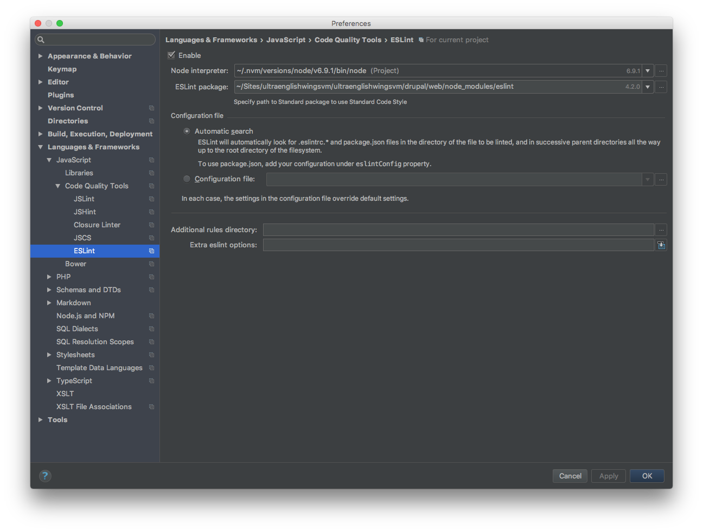
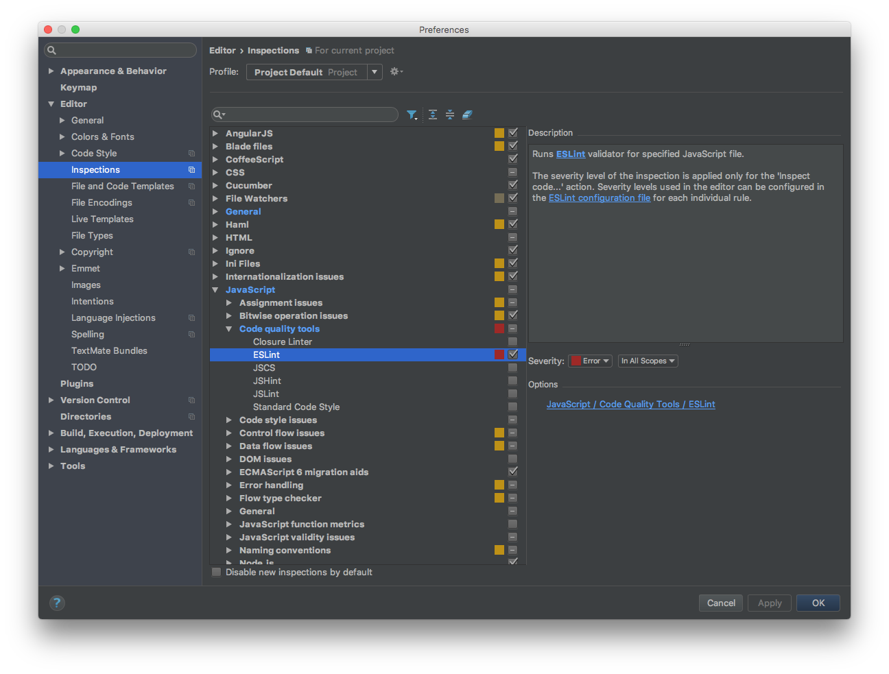
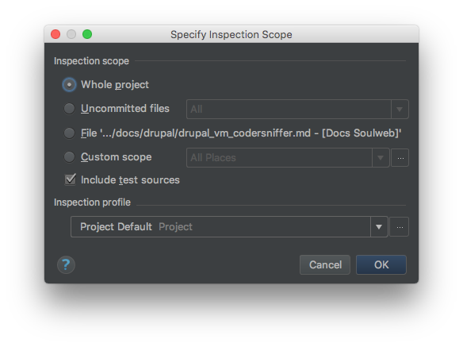

# ESLint

[ESLint](http://eslint.org/) is a tool to detect errors and potential problems in `JavaScript` code.

We use it to make sure our `JavaScript` code is consistent and free from syntax error and leaking variables and that it can be properly minified.

## Requirements

#### 1. Install Node.js using Nvm

Ensure your system has the appropriate `C++` compiler:

1. Open your terminal of choice
2. Run `xcode-select --install` as a command:
    * A popup will appear
    * Select Install
3. Allow the download to run to completion

To install `nvm` with the `cURL` method, run the following command in your terminal:

    curl -o- https://raw.githubusercontent.com/creationix/nvm/v0.33.0/install.sh | bash

After running the above install script, `nvm` should have successfully installed. To ensure that nvm is up and running on your machine, you can test it with the following command:

    nvm --version

If you are kissing the `nvm` command, after running the install script, you may be missing a `.bash_profile`.

Run `touch ~/.bash_profile` in your command line and re-run the installer script.

If the problem persists after that, you can open the existing `.bash_profile` file (using your favorite text editor) and add the following line to it:

    export NVM_DIR="~/.nvm"
    [ -s "$NVM_DIR/nvm.sh" ] && \. "$NVM_DIR/nvm.sh"  # This loads nvm

Now you can use `nvm` to install `node.js`. To install the latest available version of `node.js`, you can use the following command:

    nvm install node

Next, to use that version of `node.js` in any new shell, you can simply run the use command:

    nvm use node

Nvm is great and makes switching between node versions easy and convenient. However, there's one caveat. If you type:

    which node

you will see something interesting. `Nvm` installs `node.js` inside your user's home directory. It's best to install one copy of node globally so that other users can access it, and use `nvm` to switch between your development versions.

To do this, run the following command (entering your user's password at the prompt):

    n=$(which node);n=${n%/bin/node}; chmod -R 755 $n/bin/*; sudo cp -r $n/{bin,lib,share} /usr/local

The above command is a bit complicated, but all it's doing is copying whatever version of `node` you have active via `nvm` into the `/usr/local/` directory (where user installed global files should live on a linux `VPS`) and setting the permissions so that all users can access them.

!!! tip "Change node.js version"
    If you ever want to change the version of `node` that's installed system wide, just do another `nvm` use `vXX.XX.XX` to switch your user's node to the version you want, and then re-run the above command to copy it to the system directory.

## Install and configure ESLint

#### 1. Install ESLint

We are gonna install `ESLint` as part of our project build locally:

Open your terminal of choice and move to local `drupal/web` direcory of your project and run:

    npm install eslint --save-dev

Make sure the `ESLint` is executable:

    chmod +x ./node_modules/.bin/eslint

You should then setup a configuration file:

    ./node_modules/.bin/eslint --init

To ensure that ESLint is working on your machine, you can test it with the following command:

    ./node_modules/.bin/eslint --version

#### 2. Git ignore ESLint package files

Edit the main `.gitignore` file to add the `ESLint` package files.

The files/folders to ignore are:

* Folder `/web/node_modules/`
* File `package.json`
* All the files under `web/` named like `=2.x.x` `=3.x.x` `=4.x.x` etc.

#### 3. Integrate ESLint in PhpStorm

Open your settings and go to `Language & Frameworks > JavaScript > Code Quality Tools > ESLint`.

* check `Enable`
* `Node interpreter` should be pre populated, if not choose yours
* populate `ESLint package` with `{yourlocalprojectdirectory}/drupal/web/node_modules/eslint`
* `IDE` should automatically find your  configuration file, but you can specify path to it
* all other options you can left empty

Now head to `Editor > Inspections > JavaScript > Code quality tools > ESLint` and enable it.

## Inspect Code

To inspect your code select, from the menu, `Code` -> `Inspect Code`. On the shown window select what you wanna inspect and click `OK`.

