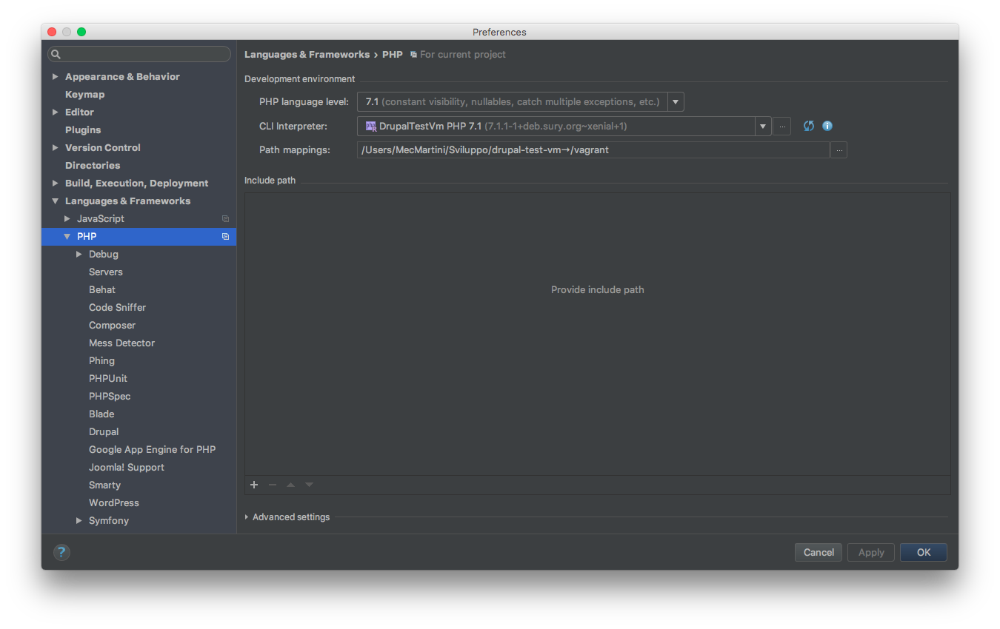

# PhpStorm Project

Make sure to have the latest [PhpStorm](https://www.jetbrains.com/phpstorm/download) available for a better support.

## Create new project Vagrant based

#### 1. Create new project

Open `PhpStorm` and select `Create New Project from Existing File`

Select `Sources file are in a local directory, no Web server is yet configured.`

Select your `Drupal` installation directory on the local machine, make it the `Project Root` and click on `Finish` button

Once the project is created, `PhpStorm` will index your project files and must recognise it as a `Drupal` project. It should ask to enable the `Drupal` support. If not, enable it by yourself:

#### 2. Integrate Vagrant

To let `PhpStorm` find the vagrant executable run the following on your local machine:

    sudo ln -s /usr/local/bin/vagrant /usr/bin/vagrant

!!! note "Note"
    in case the executable is in a different path then `/usr/local/bin` change it, you can find the vagrant path with `whereis vagrant`
    
To integrate `Vagrant` set the `Instance Folder` on the `Vagrant` settings:

Then select the `Current Vagrant` on `SSH Terminal` settings:

Create the new Vagrant `Deployment` server clicking on `+` button in the following settings:

Enter a `Name` and select Type `SFTP`:

Click `OK` button and configure the rest as:

    SFTP host: your vagrant_hostname
    Root path: your Drupal installation path on the vagrant machine
    Username: vagrant 
    Password: vagrant

Go on the `Mappings` tab and set only the `Deployment path on server` with your `Drupal` installation path on the `vagrant machine`

Set your vagrant `PHP interpreter`. From the following click on `…` of `CLI Interpreter`:

Click on `+` button and select `Remote`. Set the interpreter as below, selecting `Vagrant` and setting the `Vagrant Instance Folder` to your `Vagrant` folder:

Go to `Settings` -> `PHP` -> `Servers` and click on `+` button:

Set your `Name` and `Host`. Check `Use path mappings` and enter the `Absolute path on the server` to your `drupal` installation on vagrant machine.

## Add GitHub repository and Initial Commit

Share the project on `GitHub`:

Write the `New repository name`, select `private`, if needed, and click on `Share`

Add files for `initial commit` and `push` on git by clicking on `OK` button

## Import to existing GitHub repository and Initial Commit

Enable version control integration from PHPSTORM:

Set the `Remote` origin of the existing `git` repository adding the repository `url` (e.g. `https://github.com/mecmartini/soulweb-docs.git`)

Push the `initial commit` (see [Add GitHub repository and Initial Commit](drupal_vm_phpstorm.md#3-add-github-repository-and-initial-commit)).

## Plugin Requirements

Here are listed the required PhpStorm plugins for our development workflow.

#### Install/Enable PhpStorm Plugin

From your project `settings` go to `Plugin`:

Search the required `plugin` on the list and enable it (click on the right checkbox of the `plugin` name).

If it's not listed  you must install it. Press on `Browse Repositories`, search for your `plugin`, select it and click on `Install` on the right side:

Close the `Browse Repositories` window. Now you'll find it on the list to enable it.

#### Drupal Symfony Bridge Plugin

[Drupal Symfony Bridge Plugin](https://github.com/Haehnchen/idea-php-drupal-symfony2-bridge)

Provides Symfony components support for Drupal in PhpStorm.

#### Pre Commit Hook Plugin

[Pre Commit Hook Plugin](https://github.com/yahely/PreCommitHookPlugin)

Plugin that allows you to run a hook prior commiting changes to any Version Control System. Good for Version Control Systems that doesn't allow you to run pre-commit-hook on the client side.
