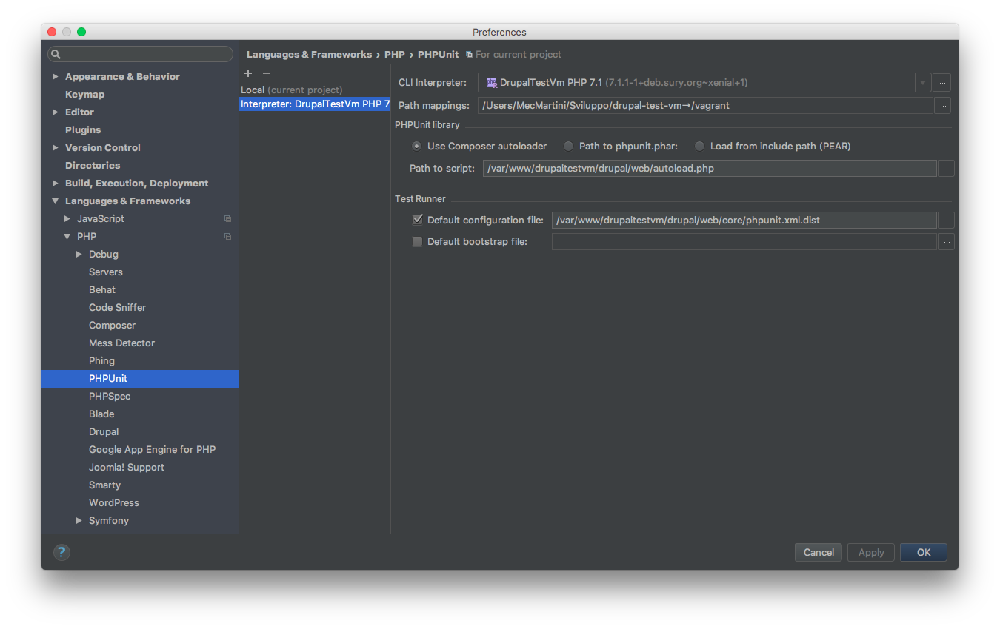

# PHPUnit

#### 1. Integrate PHPUnit in PhpStorm

Enable the `Testing` module on your `drupal` installation. Access on your `vagrant` machine (`vagrant ssh`), go under the `drupal` installation directory and run:

    drush en -y testing

Open the file `web/core/phpunit.xml.dist`, under your `drupal` installation directory, and fill in `SIMPLETEST_DB`, `SIMPLETEST_BASE_URL` and `BROWSERTEST_OUTPUT_DIRECTORY`.
Go under `Settings` > `Language & Frameworks` > `PHP` > `PHPUnit`. Click on the `+` button and select `By Remote Interpreter`

Set the `Interpreter` as below. In `Path to script` and `Default configuration file` enter the directory path of your `vagrant` machine

To run all `drupal` tests go under `Edit configurations`. Click the `+` button and select `PHPUnit`

Set only the `Name`

To test if it works select your `PHPUnit` config and click on `run` (`play button`)

