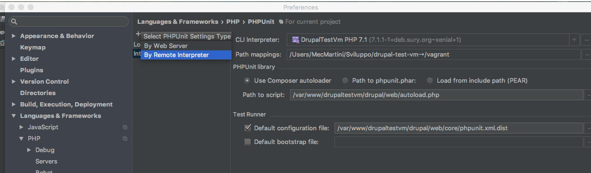
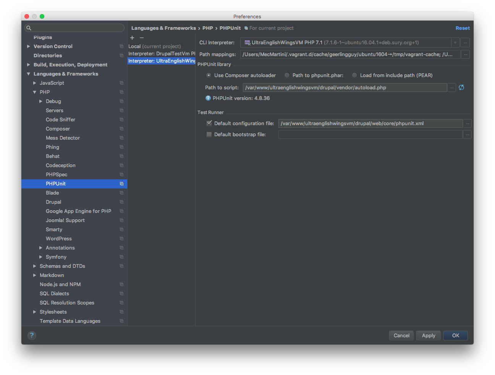
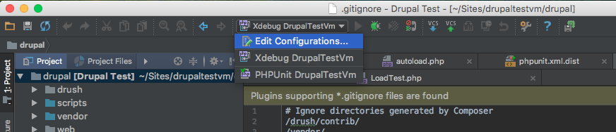
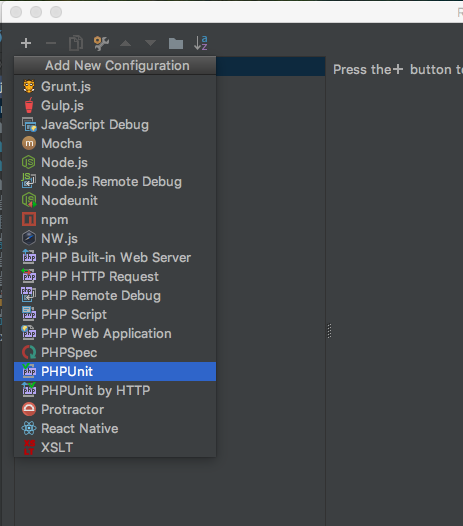
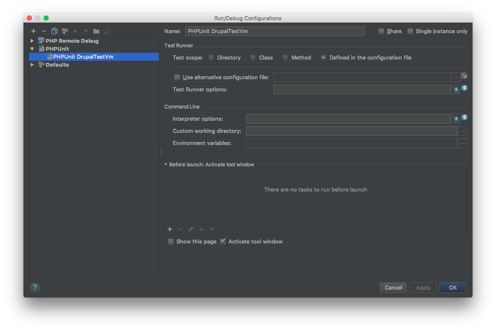
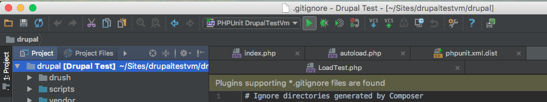
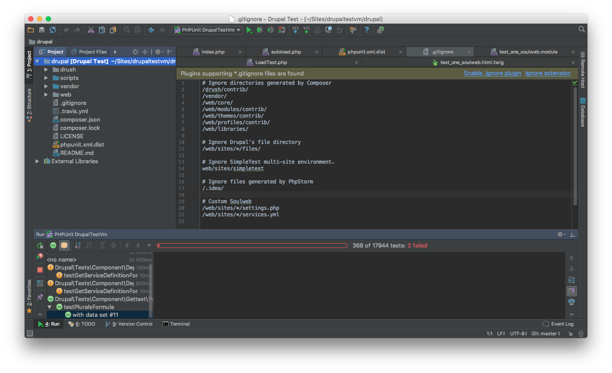
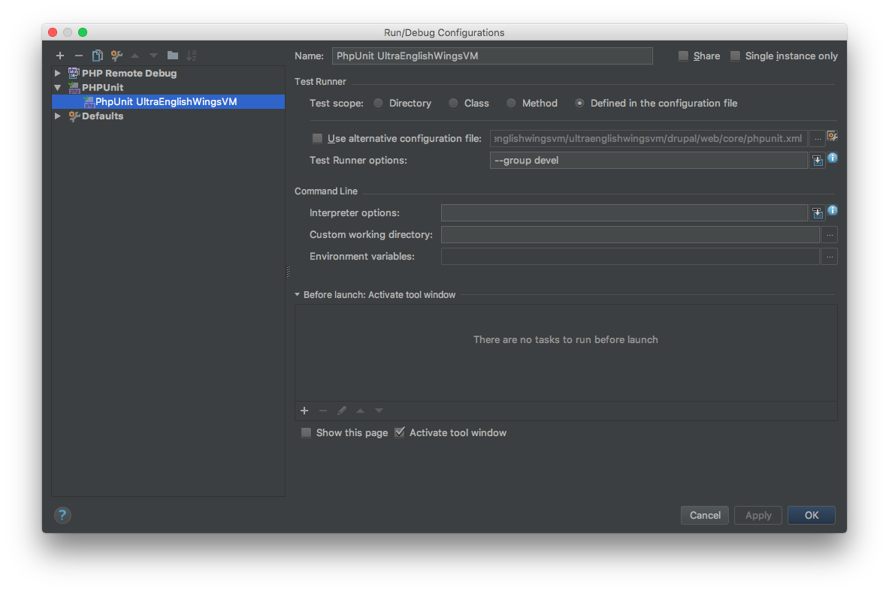

# PHPUnit

#### 1. Integrate PHPUnit in PhpStorm

Copy the `web/core/phpunit.xml.dist` file to `web/core/phpunit.xml` under your `drupal` installation directory.

Edit the created file with your favorite editor and full fill the parameters `SIMPLETEST_DB`, `SIMPLETEST_BASE_URL` and `BROWSERTEST_OUTPUT_DIRECTORY` (see the eamples provided into the file).

Go under `Settings` > `Language & Frameworks` > `PHP` > `PHPUnit`. Click on the `+` button and select `By Remote Interpreter`

Set the `Interpreter` as below. In `Path to script` and `Default configuration file` substitute the directory path of your `vagrant` machine

#### 2. Set and Run PHPUnit Test

To run all `drupal` tests go under `Edit configurations`. Click the `+` button and select `PHPUnit`

Set only the `Name` and the `Test Scope` as below:

To test if it works select your `PHPUnit` config and click on `run` (`play button`)

You can create as many `PHPUnit` configuration do you need, to run subset of test, setting the `Test Runner options`.

The example below shows how to setup it to run only the test of the group `devel`:

The `--group devel` options is added to the `Test Runner options`.

To run multiple groups of tests:

    --group Group1,Group2,..

To exclude tests:

    --exclude-group Groupname

To run a specific method:

    --filter=MyMethodTest