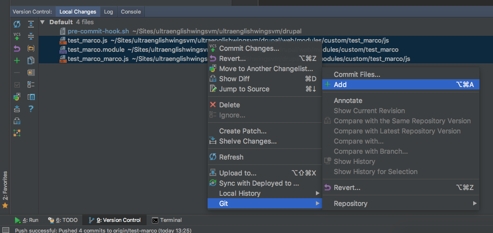
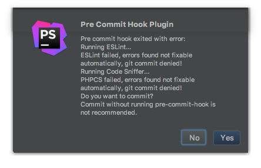

# Pre Commit Hook

The `PhpStorm` commit window already integrate the `Perform code analysis` tool but, for some reason, it's not able to run the `PHP Code Sniffer Validation` as when you launch the normal `Inspect Code`.

So we need to setup an alternative way to do it properly through the git pre-commit hook.

## Setup a Git pre-commit hook to check Coding Standards

First of all make sure to have the [Pre Commit Hook Plugin](drupal_vm_phpstorm.md#pre-commit-hook-plugin) for `PhpStorm` installed and enabled.

The following instructions are to setup the `pre-commit` hook script at the init of the project. If you are not sure that your project was already init for it you must check for:

* your `composer.json` and look for the package `jover_be/drupal-code-check` (probably it's under `require-dev`)
* your `drupal` root directory and look for the `pre-commit-hook.sh` file

If you have both you can jump directly to [Run the Pre Commit Code Analysis](drupal_vm_codersniffer.md#3-run-the-pre-commit-code-analysis).

#### 1. Install Drupal Code Check Package

[Drupal Code CHeck](https://packagist.org/packages/jover_be/drupal-code-check)

From your `vagrant` machine on your `drupal` root directory run:

    composer require --dev jover_be/drupal-code-check

#### 2. Pre Commit Hook Script

The `Pre Commit Hook Plugin` looks for the `pre-commit-hook.sh` file script on your project root directory. To create it, from your drupal root directory run:

    touch pre-commit-hook.sh

Make sure the `pre-commit` script is executable:

    chmod +x pre-commit-hook.sh

Populate the script with our default. Copy and paste the content of [Drupal Pre Commit Hook](https://github.com/mecmartini/drupal-pre-commit-hook/blob/master/pre-commit).

This script run a [Coder Sniffer](drupal_vm_codersniffer.md) and [ESlint](drupal_vm_eslint.md) code analysis with syntax auto fix, so make sure to have them installed as required.

#### 3. Run the Pre Commit Code Analysis

To make the `pre-commit` script work, you must run `git add` of the files to commit before the commit itself.

The script is set to check only those added file to avoid to check all the modified files that could be not involved in your commit.

To `git add` the files of your commit in `PhpStorm`:

If everything is well set, when you perform a commit, `PhpStorm` auto-run the Code Analysis and, in case of `errors`/`warnings`, it's gonna show you something like this:

In case of `errors`/`warnings` it's suggested to undone the commit and manually run the `Inspect Code` to fix all the possible issues. A better workflow is to manually run the `Inspect Code` before to commit.