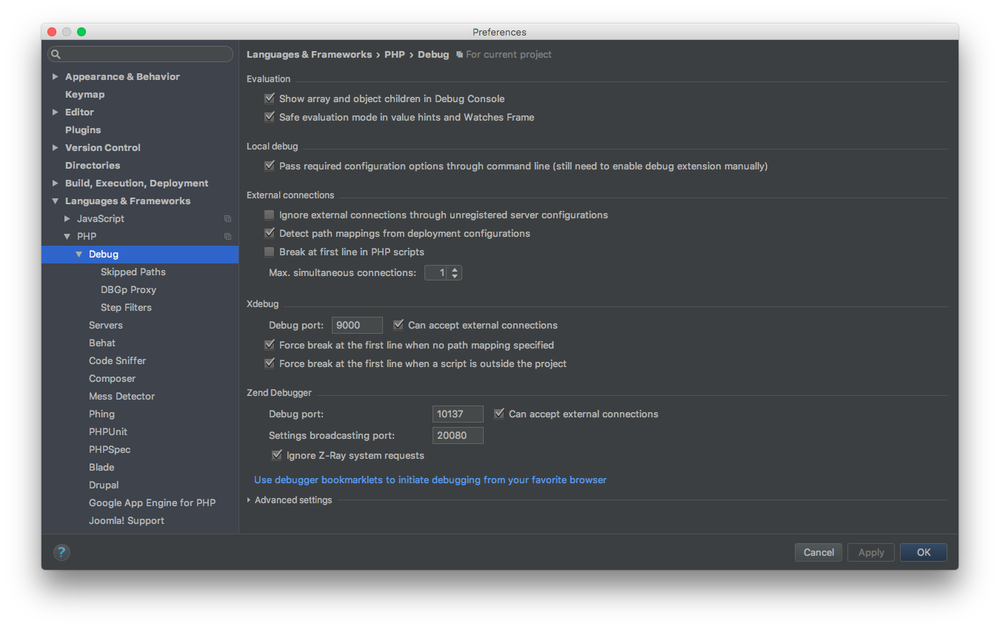
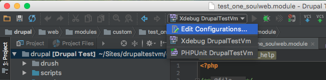
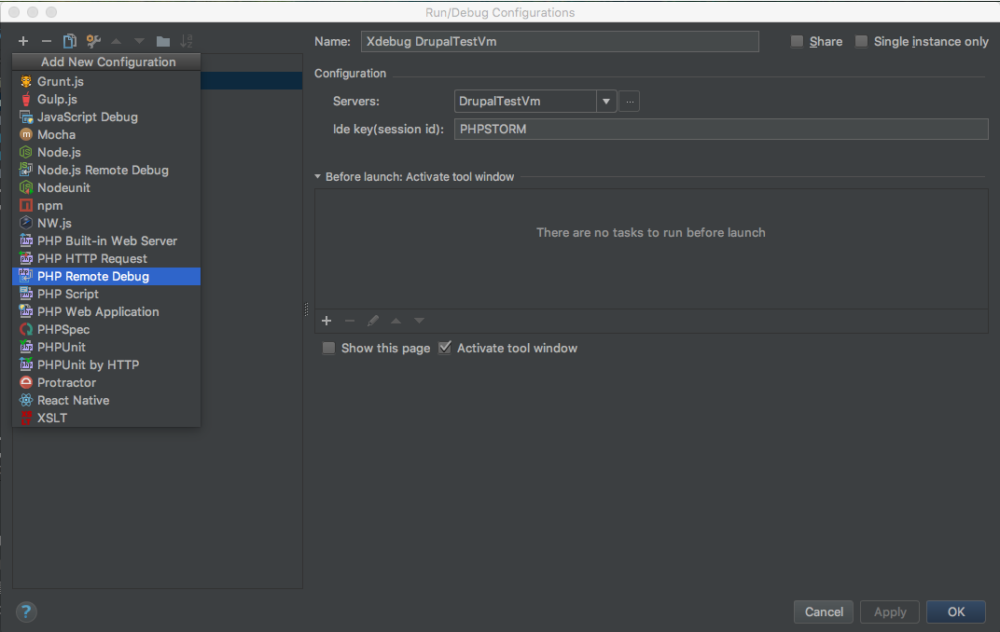
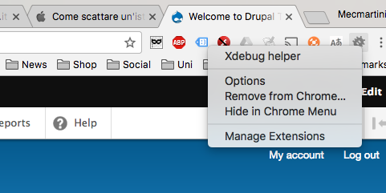
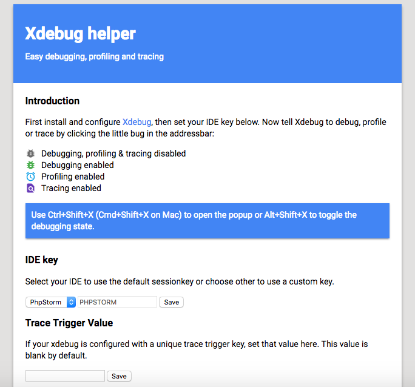
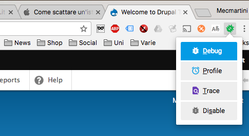
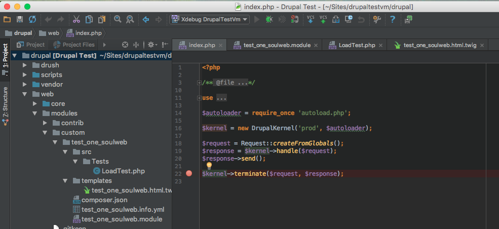
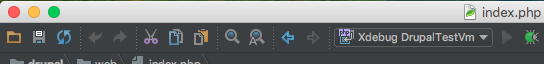
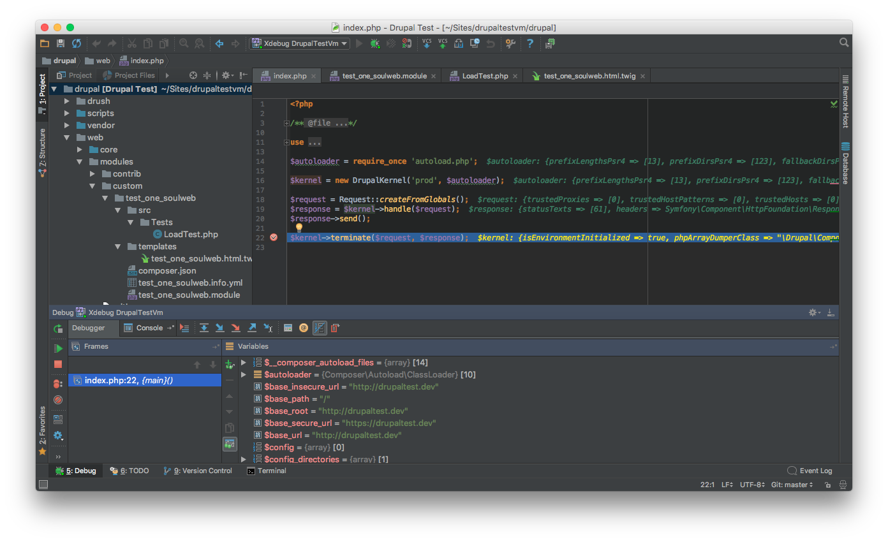

# Xdebug

#### 1. Enable Xdebug on your Vagrant machine

Open the vagrant machine `config.yml` file and make sure to have the xdebug line uncommented on `installed_extras`

    installed_extras:
          - adminer
          # - blackfire
          - drupalconsole
          - drush
          # - elasticsearch
          # - java
          - mailhog
          # - memcached
          # - newrelic
          # - nodejs
          - pimpmylog
          # - redis
          # - ruby
          # - selenium
          # - solr
          # - tideways
          # - upload-progress
          # - varnish
          - xdebug
          # - xhprof

Make sure to have the following lines set as:

    # XDebug configuration. XDebug is disabled by default for better performance.
    php_xdebug_default_enable: 1
    php_xdebug_coverage_enable: 1
    
Add the port `9000` to `firewall_allowed_tcp_ports`

    firewall_allowed_tcp_ports:
      - "22"
      - "25"
      - "80"
      - "81"
      - "443"
      - "4444"
      - "8000"
      - "8025"
      - "8080"
      - "8443"
      - "8983"
      - "9000"
      - "9200"
      
From your `terminal` go on the `vagrant` directory and run `vagrant up --provision`, to apply the changes on your `vagrant` machine, or run `vagrant provision` if your machine is already up.

#### 2. Integrate Xdebug in PhpStorm

On `PhpStorm` go to `settings`.

Make sure to have `Xdebug` -> `Debug port` set to `9000`:

From `PhpStorm` click on `Edit Configurations…`:

Click on `+` button and select `PHP Remote Debug`:

Select you Server (see [Add GitHub repository and Initial Commit](drupal_vm_phpstorm.md#2-integrate-vagrant)) and set `Ide key` to `PHPSTORM`.

Install `Xdebug helper` as `Chrome` extension (also available on Firefox)

!!! note "Note"
    similar extensions are available also for `Firefox` (e.g. `theeasiestxdebug`).

A new icon should appear on `Chrome`. Right click on it and select `Options`.

Select `PhpStorm` on `IDE key` and save it

Click on `Xdebug helper` icon and select `Debug`

Now you should be ready to debug. Set a breakpoint on your Drupal `index.php` clicking on the right of the code row number. A red point must appear.

To start to `debug` click on the `bug` icon

Then navigate on your `Drupal` installation from the browser and you will see the debugger in action

To continue the execution of `Drupal` after the `breakpoint` click on `Resume Program` (`play` button on the left of `Debugger` tab).

To stop the debugger click on `Stop` (`stop` button on the left of `Debugger` tab).

#### 3. Xdebug and Twig

To use `Xdebug` on `Twig` templates make sure that:

1. you have installed and enabled the contrib `module` [devel](https://www.drupal.org/project/devel) (installed by default on `DrupalVM`)
2. `Twig` debug is enabled (see [Disable Drupal Caching](drupal_basic_configuration.md#4-disable-drupal-caching))

Then set a breakpoint into your template adding:

    {{ devel_breakpoint() }}

Reference on [Drupal 8, Xdebug, and Twig](https://www.chapterthree.com/blog/drupal-8-xdebug-and-twig-an-update).